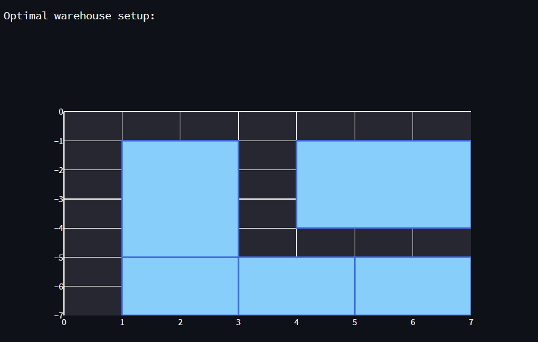
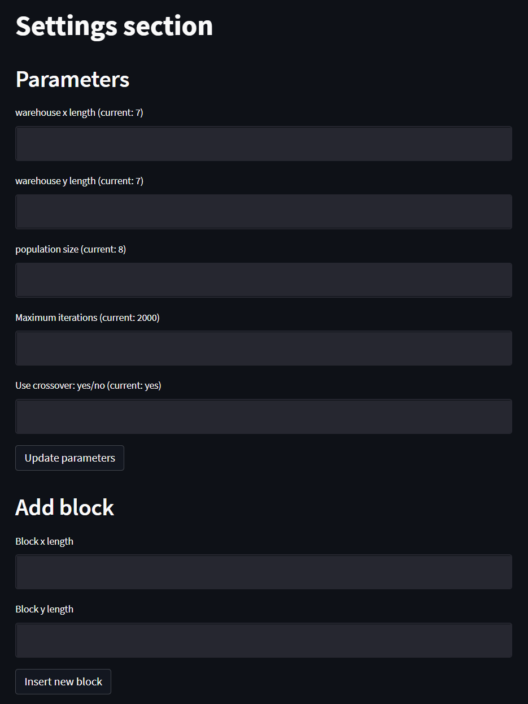

# Evolutionary algorithm for optimization of occupated space in warehouse, with respect for path to each stored element 

## Introduction
This project provides the implementation of an evolutionary algorithm for optimization of occupated space in the warehouse. During the evolution, the algorithm considers whether there is access to each item stored in the warehouse - if not, a penalty is applied to the score.

### Example output for a small warehouse 

## Requirements

To run the code, Python 3.x is required, with the following packages:

* NumPy
* Pandas
* Streamlit 

## Running applicaion 

To run the application, just type: `streamlit run main.py` in the scripts directory.

## Interface 

User interface (made with Streamlit) allows you to change algorithm parameters and define new items.  

